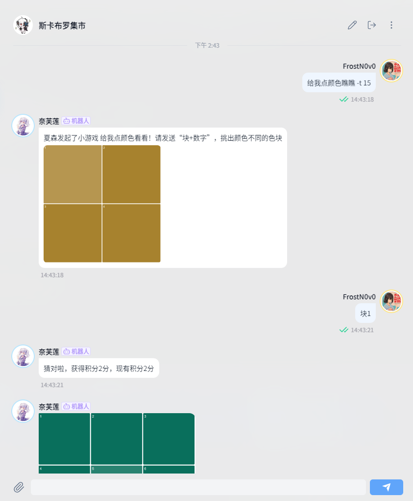
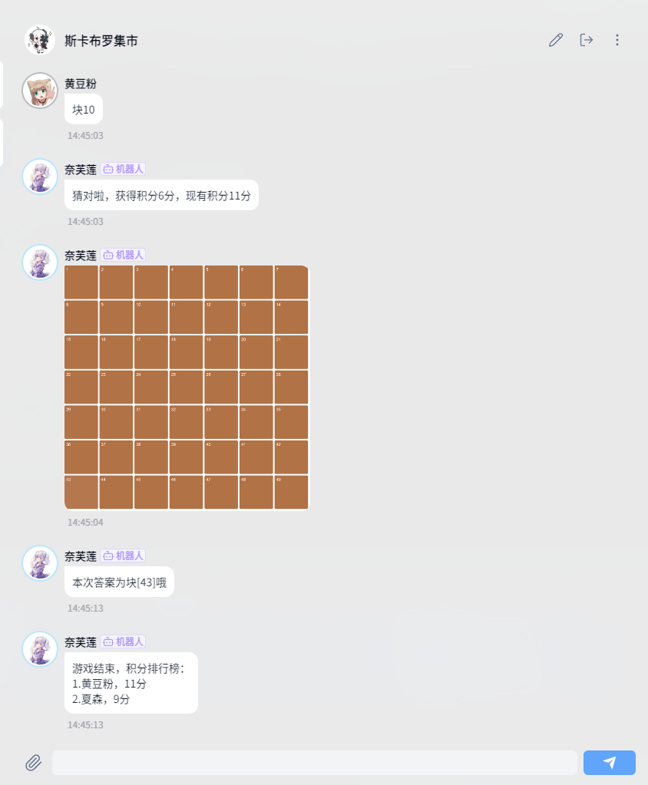

  
   

# nonebot-plugin-color-see-see

_✨ 给我点颜色看看，猜色块小游戏 ✨_

## 📖 介绍

给我点颜色看看，猜色块小游戏

## 💿 安装

使用 nb-cli 安装

在 nonebot2 项目的根目录下打开命令行, 输入以下指令即可安装

    nb plugin install nonebot-plugin-color-see-see

使用包管理器安装

在 nonebot2 项目的插件目录下, 打开命令行, 根据你使用的包管理器, 输入相应的安装命令

pip

    pip install nonebot-plugin-color-see-see

pdm

    pdm add nonebot-plugin-color-see-see

poetry

    poetry add nonebot-plugin-color-see-see

conda

    conda install nonebot-plugin-color-see-see

打开 nonebot2 项目根目录下的 `pyproject.toml` 文件, 在 `[tool.nonebot]` 部分追加写入

    plugins = ["nonebot_plugin_color_see_see"]

## 🎉 使用
### 指令表
| 指令 | 权限 | 需要@ | 范围 | 说明 |
|:-----:|:----:|:----:|:----:|:----:|
| color/给我点颜色看看 | 所有 | 否 | 私聊 | 开始猜色块游戏，支持参数-t 指定游戏超时时间 如 color -t 15 |
| 块+数字 | 所有 | 否 | 群聊 | 选择颜色不同的色块，如 块1 或 块 1 |
### 效果图

